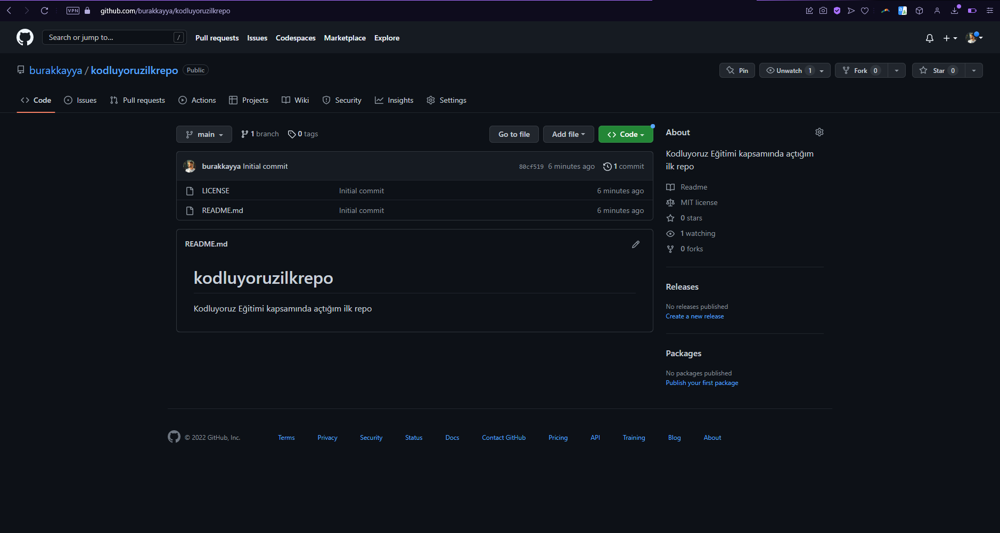

# Kodluyoruz İlk Repo
Bu repo [Kodluyoruz](https://kodluyoruz.org/tr/kodluyoruz/?_ga=2.189907627.1209443207.1672055985-1299545619.1668440650&_gl=1%2A1x9tb1b%2A_ga%2AMTI5OTU0NTYxOS4xNjY4NDQwNjUw%2A_ga_MY3W9VG77C%2AMTY3MjA1NTk4NS41LjEuMTY3MjA1NjM1NC4wLjAuMA..) Eğitimi kapsamında oluşturduğum ilk repo. İçerisinde bir adet README.md dosyası, bir adet de index.html barındırıyor.




## Installation
Öncelikle repoyu clonelayın.
```
 git clone https://github.com/burakkayya/kodluyoruzilkrepo.git
```
## Usage
Projeyi cloneladıktan sonra Visual Studio Code programında açınız.

Linux için:
```
cd kodluyoruzilkrepo
code .
```

## Contributing
Pull requestler kabul edilir. Büyük değişiklikler için, lütfen önce neyi değiştirmek istediğinizi tartışmak için konu açınız.

## License
[MIT](https://choosealicense.com/licenses/mit/)


